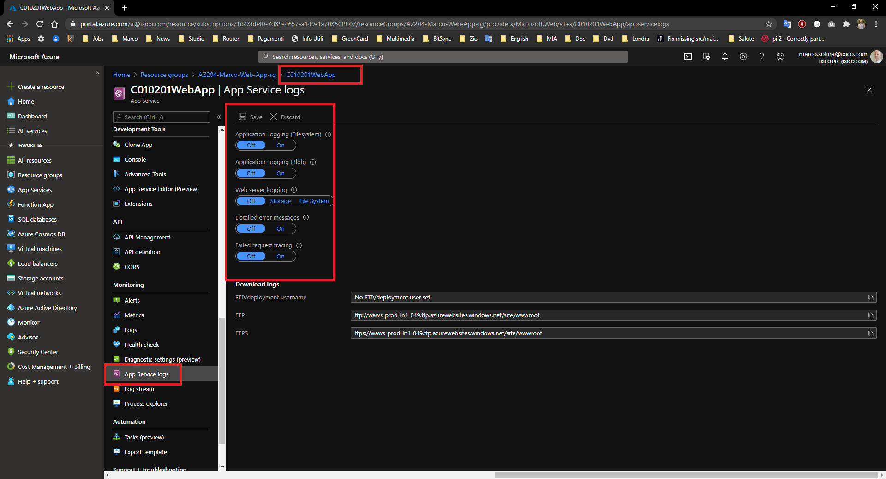

# Enable Diagnostic Logging

- Azure App Service fornisce un meccanismo per attivare log di diagnostica a diversi livelli:
  - **Web Server diagnostics**: Sono messaggi genrati direttamente dal web server, ce ne sono di tra tipi:
    - **Detailed error loggin**: Questo log contiene le informazioni di ogni HTTP request che ha generato un error >= 400. Viene creata una pagina HTML per ogni errore, per un max di 50 file HTML, questi file sono salvati sul file sistem dove gira la web app. Quando si raggiunge il limite i 26 file più vecchi vengono eliminati
    - **Failed request tracing**: Questo log contienre informazioni dettagliate sulle richieste fallite verso il server. Le informazioni contengono il trace di IIS, e come nel caso precedene sono salvate con le stesse "retention policies"
    - **Web server logging**: Questo log registra le transazioni HTTP delle richieste fatte al web sever. Sono salvate nel formato W3C extended. Si possono configurare "retention policies" personalizzate. Non sono eliminate di default, ma sono ristrette all spazio del file system, default 35MB
  - **Application diagnostic**: Puoi inviare messagi log direttamente dal tuo codice all'application diagnostic log, usando il tuo sistema di log standard. E' diverso dall'Application Insight, per il quale devi usare l'apposito SDK
  - **Deployment diagnostics**: Questo è attivato automaticamente, scrive tutte le informazioni relative al deployment della tua app.
- Puoi attivare i diversi tipi di log dall portale Azure, apri la tua web app, e nella barra a sinistra, nella sezione "Monitoring" clicca sulla voce "App Service Log" 
- Quando configuri l'application logging, puoi indicare dove salvare i file di log. Puoi scegliere tra il file system o il Blob storage.
- Salvare i log nel file system è inteso per operazioni di debug, viene infatti disattivato automaticamente dopo 12 ore.
- Se vuoi salvare i log per più tempo devi salvarli nel blob storage.
- Se configuri il log nel file system, i file vengono salvati in:
  - **/LogFiles/Application/**: log creati dall'applicazione
  - **/LogFiles/W3SVC####/**: Trace delle richieste fallite
  - **/LogFiles/DetailedErrors/**: *.html con i detagli degli error
  - **/LogFiles/http/RawLogs/**: Web Server log in formato W3C extended
  - **/LogFiles/Git/**: Log generati durante il deploy della app. Sono disponibili anche nella cartella D:\home\site\deployments
- Puoi scaricare i log in due modi, FTP/S o Azure CLI
- Puoi visuallizzare i log anche in diretta, dal portale (Log stream nella sezione "Monitoring", guarda l'immagine precedente) o tramite Azure CLI
