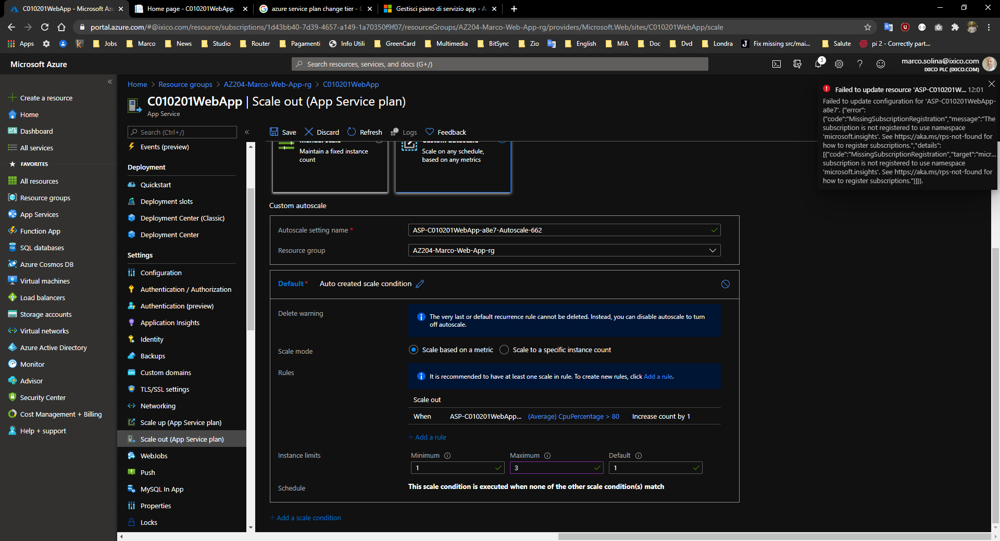

# Deploy Code to a Web App

- Azure App Service fornisce dei deployments slots. Questi slots sono i deployments della mia web app che risiede nello stesso App service
- Un deployment slot possiede la sua configurazione ed hostname.
- Puoi usare questi slot per testare il codice prima di passare allo slot di produzione
- Il benefit è che poi scambiare questi slot senza downtime
- Quando voglio fare il deploy della mia app Azure offre:
  - **ZIP or WAR files**: Vengono deployati utilizzando il servizio Kudu
  - **FTP**: Puoi copiare i file della tua app direttamente nell'App Service tramite FTP/S
  - **Cloud Synchronization**: Utilizza Kudu, ti permettere di tenere i file su OneDrive o Dropbox
  - **Continuous deployment**: Azure si integra con GitHub, BitBucket o Azure Repos per eseguire il deploy. In base al servizio, puoi usare Kudo build server o Azure Pipelines per implementare CI. Puoi anche configurare le integrazioni manualmente con altri cloud repo come GitLab
  - **Your local Git repository**: Puoi configurare il tuo App Service come repository remoto del tuo repo locale, e fai il push del codice ad Azure. Kudo poi compila e fa il deploy nell'App Service
  - **ARM Template**: Puoi usare VS e ARM per fare il deploy (Tasto destro sul progetto VS e seleziono Publish)
- Al lavoro ci siamo creati noi le CI e CD pipeline. Il libro mi ha mostrato un modo per creare le pipeline direttamente dalla web app. Nel portale, apro la webapp, a sinistra o la sezione "Deployment", scelgo "Deployment Center" e seguo le isruzioni a video
- Nell menu di configurazione delle WebApp nel portale Azure, posso:
  - **Application Settings**: specificare le propriet&agrave; che vanno a sostituire le propriet&agrave; che di solito metto nell "appsetings.json". Queste propriet&agrave; sono "encrypted at rest".
  - **Connection Strings**: configurare I valori per le connessioni al DB, sono le stesse che metterei nel "appsettings.json". (Non ho mai fatto questo al lavoro).
  - **General Settings**: Sono configurazioni che dipendono dall tipo di piattaforma che decido di usare. Posso configurare lo stack (che uso PHP, Java, Python, .NET etc), piattaforma (32, 64bit) ed altre cose
- Una volta configurate le "App settings" o "Connection strings" ci posso accedere dal codice con funzioni simile a queste:
  - getenv("APPSETTING_nome_della_mia_app_setting")
  - getenv("SQLAZURECONNSTR_nome_della_mia_conn_strings")
  - Notare il prefisso, per il DB ci sono diversi prefissi, MySql, Postgres etc
- **Autoscaling**
  - Scale up or down: aggiungi o togli risorse, la macchina viene spenta ed aggiornata
  - Scae in or out: si creano/distruggono copie della macchina all'interno dello stesso set
  - Quando attivo l'autoscaling lo faccio aggiungento delle regole:
    - Regole in base alla Data/ora
    - In base al carico (CPU, RAM, Coda HTTP)
    - Custom
  - Posso attivare l'autoscaling per un certo gruppo di risorse
    - Azure virtual machines
    - Azure Service Fabric
    - Azure App Service
    - Azure Cloud Services
  - Quando lavoro con l'autoscaling devo creare dei profili, che mi dicono quando aggiungere o rimuovere risorse.
  - Ho provato l'esercizio per l'autoscaling ma non sono autorizzato
    
  - **Quando imposto una regola per fare lo scale out, questa regola funziona solo per aumentare le risorse. Se la situazione si ristabilizza, le nuove risorse non vengono distrutte. Devo creare una regola per lo scale in, che rimuove le cose che non sono pi&ugrave; necessarie!!!**
